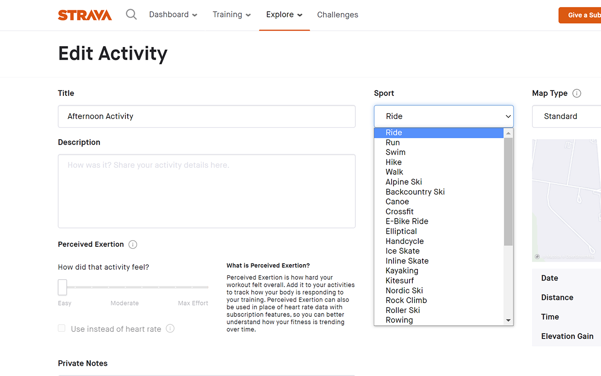
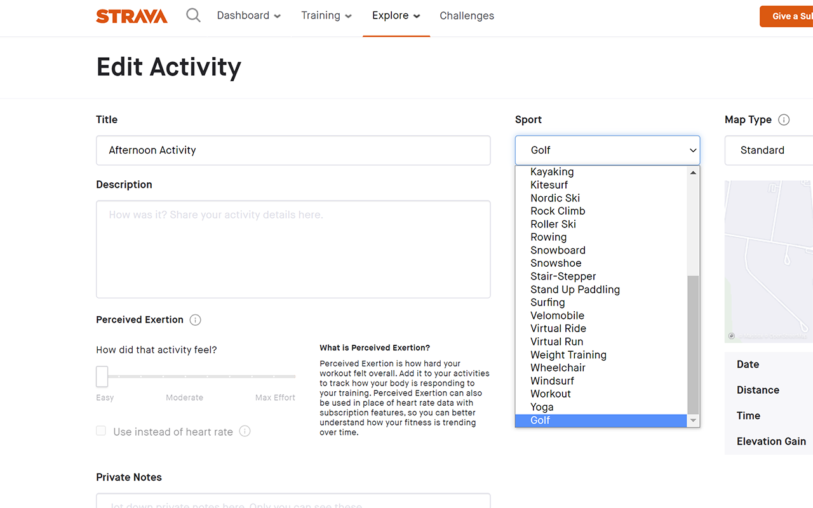

# Strava Golf Chrome Extension
Chrome extension to add Golf to the list of activities in Strava.

## Description

While Strava supports golf activities, the only way to add a golf activity is to import the golf activity from another platform such as Garmin. However, this means that when you go to the edit activity on Strava (to rename your activity or change the privacy of the activity), there is no Golf option. As a result, suddenly, your golf activity changes from golf to your last activity type, such as walk.

This extension auto injects a Golf activity into the dropdown list of activity types on the Strava activity edit page. Suppose the activity that you are currently editing is already a golf activity. In that case, the extension will select the Golf activity for you.

## Installation

Get [Strava Golf](https://chrome.google.com/webstore/detail/strava-golf/miapificdlbegddpaadhnniggaomcnim) from the Chrome Web Store.

## Images

|  |
|:--:|
| *Before* |

|  |
|:--:|
| *After* |

   
  
<a target="_blank" href="https://icons8.com/icon/9767/golf">Golf</a> icon by <a target="_blank" href="https://icons8.com">Icons8</a>
